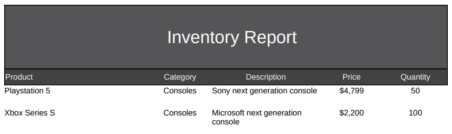

# inventory-service
Proof of concept using Micronaut and Jasper Reports

- [x] [Micronaut 3.7.3](https://micronaut.io/)
- [x] [Micronaut Data](https://micronaut-projects.github.io/micronaut-data/latest/guide/)
- [x] [Micronaut Test Resources](https://micronaut-projects.github.io/micronaut-test-resources/latest/guide/)
- [x] [IReport 6.20](https://sourceforge.net/projects/jasperstudio/files/JaspersoftStudio-6.20.0/)
- [x] [Micronaut Flyway](https://micronaut-projects.github.io/micronaut-flyway/latest/guide/)
- [x] Java 11
- [x] Docker
- [x] Postgres


## Running the project
This command starts all containers and builds the project.
```console
inventory-service % make start
```

## Generating report
This sample request will return a PDF report with default products for testing.



```console
curl --location --request GET 'http://localhost:8080/reports/inventory' \
--header 'accept: application/json' \
--header 'Content-Type: application/pdf'
```